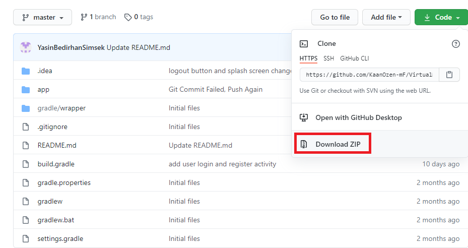

# Virtual Market Mobile Application

## Authors:
- Yasin Bedirhan Şimşek 182010020068
- Kaan Özen 172010010022

## General Information

This is a virtual market application written in **Kotlin for Android operating system**. This is our final project for CENG3011 Programming Languages Course.

**This application uses Google Firebase Database system for data storage**

**Android Stuido is used for development of this project**

Further details about Firebase : https://firebase.google.com/

Android Stuido: https://developer.android.com/studio

## How to run the application

###In order to run the application, project files must be imported to Android Studio. After that an emulator is needed to simulate the application as if we it is running on a real Android Phone

1. Android Stuido has to be installed https://developer.android.com/studio 

2. Download the project from the GitHub as a zip file

3. Rename downloaded zip file to VirtualMarket

4. Extract the zip file and open Android Studio

5. Select open an existing project option 

6. Find the extracted folder in step 4. Android Studio should see the folder as a project folder and show an android symbol right next to folder name. After selecting the project folder, click OK

7. **Wait for gradle to finish processing project files.** After that, select Android project perspective for better project control. Click on "Project" then select Android.

8. **In order to run the application, an emulator is required** To add an emulator phone to Android Studio, select AVD Manager (Android Virtual Device Manager) at right top corner

9.1. Click Create Virtual Device button

9.1. Select Phone Category

9.2. Select one of the phones in list

9.3. Click next

10. Select R, Click next, Click finish button in the next dialog. After the phone emulator is created, close AVD Manager

11. Make sure that emulator is selected, then click the green run button to run the application

